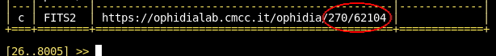
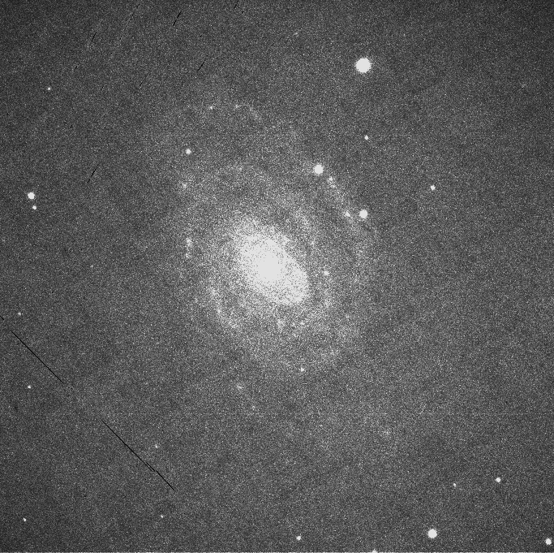
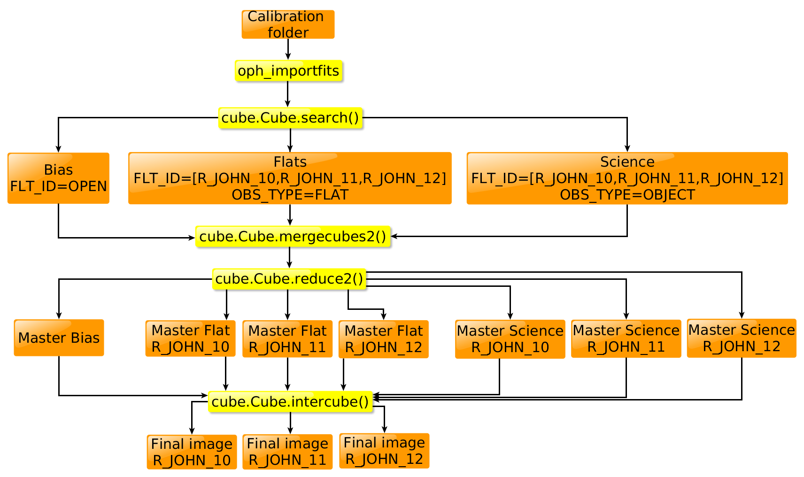
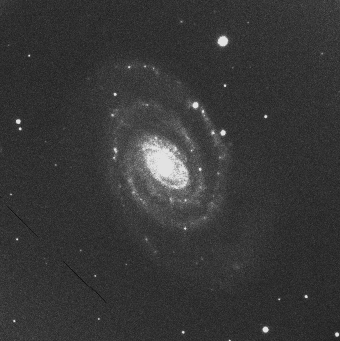

# INDIGO DataCloud Tutorial: testing Ophidia for an astronomical image calibration task

Dear User,
in order to test Ophidia for the reduction of astronomical images you are kindly requested to follow
the procedure listed below. Before you start you should have already registered a new OphidiaLab
account and have received your credentials via email. If not, please register [here](https://ophidialab.cmcc.it/register/registration.html).

This tutorial presents the output of a use-case which is the result of a collaboration between
INAF (Trieste) and CMCC (Lecce) in the context of the INDIGO DataCloud European project for
the development and improvement of open-source cloud-based software.

## Introduction to the Tutorial

**Ophidia** is a framework for data intensive analysis that exploits advanced parallel computing
techniques and smart data distribution methods. In particular, the point of strength that makes
it extremely efficient in parallel data processing is the adoption of an array-based storage model
and a hierarchical data organization for the distribution of scientific datasets over multiple nodes.
The framework was developed in the context of climate change and it has been mostly used in
that field up to now. With this use-case we aim at potentially extending its use to the field of
astronomy. Ophidia has been developed within the CMCC Foundation. More information about
the project can be found here: <http://ophidia.cmcc.it/>.

**OpidiaLab** is a science gateway that offers to the end-user the possibility to exploit the full
Ophidia potential directly from the browser. It includes a JupyterHub installation for the creation
and sharing of documents containing live code through the Jupyter Notebooks. Python bindings
are available for Ophidia (PyOphidia). OphidiaLab gives also the possibility to use the Ophidia
Terminal which is basically an Ophidia client with a functionality similar to that of the bash shell.
Both these features will be explored during the tutorial.

The image calibration test is based on a set of calibration images (bias and flats) and science
images that are already loaded into OphidiaLab. If you want to reduce your own set of images
please sent an email to londero@oats.inaf.it.

Thanks to an extension, developed in the context of this use-case, Ophidia can now read the
FITS format. The latest release of the software includes this feature. If you are interested to install
it locally on your machine, please download the code and follow the procedure described [here](http://ophidia.cmcc.it/the-official-release-of-ophidia-v1-1-0-is-available/).

Once loaded into Ophidia, two metadata keys are selected to identify the FITS files: the filter
type (FLT ID) and the observation type (OBS TYPE). For the set of images specifically used for
this tutorial, three different filters are found: B JOHN 10, V JOHN 11 and R JOHN 12. The
observation type specifies if an image is of bias, flat or science type. In case you want to reduce
your own set of images you must know the values of these two metadata keys in advance because
they need to be set in the Python script.

The tutorial begins here.

## Log in to OphidiaLab

In this section we are going to log in into OphidiaLab gateway.

1. By using the credentials received by email, log in to OphidiaLab following the [link](https://ophidialab.cmcc.it/jupyter/hub/login).
2. Get acquainted with the environment: you can find a short guide explaining OphidiaLab
capabilities in your home folder under quickstart → Quick Start.ipynb
3. the folder INDIGO-FITS/fits-raw contains all the FITS files that are going to be used
for this calibration example

## The Ophidia Terminal

In this section you will become familiar with Ophidia Terminal, and you will learn how to
create, manage and delete datacubes.

1. Open an Ophidia Terminal by clicking on the New button on the top-right part of your home page and select _Terminal_.
2. Use the `pdd` command to check your current directory.
3. Use the `lsd` command to list directories and files.
4. Create an empty container called FITS2:

        oph_createcontainer container=FITS2;dim=NAXIS2|NAXIS1;dim_type=int|int;

5. Load a FITS file (from the already available repository) in the container by giving the command:

        oph importfits src path=[path=/data/INDIGO-FITS/fits-raw;
        file=LRS.2016-06-06T20-30-03.925.fits];measure=mymeasure;
        exp dim=NAXIS1;imp dim=NAXIS2;container=FITS2
6. Use the `ll` command to check that the cube has been loaded.
7. In order to check that all the metadata of the FITS file have been loaded, replace the stars with the PID number identifying your cube in the following command (see picture):

        oph_metadata mode=read;cube=https://ophidialab.cmcc.it/ophidia/***/***;
    

8.  To select the metadata value corresponding to the `FLT_ID` key replace the stars with the PID number identifying your cube as before:

        oph_metadata mode=read;cube=https://ophidialab.cmcc.it/ophidia/***/***;
        metadata_key=FLT_ID;metadata_type=text;metadata_value=test_text;
9. Delete the cube by issuing this command, where again the stars need to be replaced:

        oph_delete cube=https://ophidialab.cmcc.it/ophidia/***/***;
10. If you experience problems try to remove the FITS2 container by using:

        oph_deletecontainer container=FITS2;
    and restart from scratch.

This section has shown that it is possible to execute Ophidia operators to manipulate the FITS files
directly from the Ophidia terminal. From the same terminal it is also possible to submit workflows
specified in a JSON file. If you want to learn more about the commands available for the Ophidia
Terminal you can check [this page](http://ophidia.cmcc.it/documentation/users/terminal/term_advanced.html).

## The Astronomical Image Calibration Process

The calibration process of astronomical images is crucial to have science ready data from images acquired with a telescope.
The figure below shows a raw image of the NGC5364 spiral galaxy as taken at the telescope without any calibration process.

The image is very noisy and the faintest spiral arms are mixed up with the background.
To improve the image quality for scientific purposes we need to use calibration frames and to 
subtract them from the raw image.
We will use three kinds of calibration frames: flat field, dark and bias.

**Flat field frames**
Flat field frames are used to address unwanted problems in the optical path, including dust, vignetting and internal reflections.
Flat field frames are usually taken from the twilight sky.
The exposure time has to be chosen in such a way that the intensity level reached about 50% of the maximum.
Flat field frames should be taken for all filters used for the raw images, about 15-20 flat frames for each filter.
With these flat field frames we can generate a master flat field frame.

**Dark frames**
The purpose of a dark frame is to remove the non-image related thermal and electronic noise
that the CCD generated when capturing raw images. It also removes imperfections of the chip,
such as hot pixels. Since we are capturing the build up of thermal and electronic noise,
it is important to match the dark frame to the same conditions as the raw image,
this should include the same duration of exposure, chip temperature, gain, brightness and contrast.
Dark frames can be taken by closing the telescope, about 15-20 images with the same exposure length as the raw images.
With these dark frames we can generate a master dark frame.

**Bias frames**
When using a CCD chip, not all the pixels start out at a value of zero.
The purpose of a bias frame is to apply it to a dark and raw images to bring all the pixels on the CCD
to an equal starting value. Bias frames can be taken by closing the telescope and capturing
at the lowest possible time setting.
Bias frames should be taken at the same temperature and settings as the raw images, about 15-20 bias frames.
With these bias frames we can generate a master bias frame.

The figure below shows a summary of the procedure that we will follow to perform calibration of astronomical images.

    
## Run the Calibration Script from a Jupyter Notebook

Now we are going to explore the Jupyter environment to perform astronomical image calibration with Ophidia.

We have prepared a Jupyter Notebook that will guide towards this goal, using PyOphidia applied to standard astronomical
image calibration routines.

1. Log in to OphidiaLab
2. Click on the Upload button on the top-right part of your home page and search for the file `fits_reduction_script.ipynb`,
    which is contained inside this git repository.
3. Click on the blue Upload button that it appears in your home;
    after that you should see the file `fits_reduction_script.ipynb` in your home directory.
4. Open it by clicking on it. The notebook is divided in Sections.
5. In Section I, fill in the credentials used for accessing OphidiaLab; this way you will connect
    to the server instance. Notice that from PyOphidia the modules client and cube are
    imported: the first is used for submitting any type of request (from simple tasks to
    workflows) while the second makes the direct interaction with the cubes (in our case
    the metadata and data of the FITS files) possible. Click on the cell and run it by using
    the run cell button at the top of the page identified by the symbol:
    
6. In Section II, the FITS files are imported onto Ophidia by specifying the path and the
    dimensions of the files (NAXIS1 and NAXIS2 for optical images). Click on the cell and
    run it. The following two cells set the values of the metadata for the filters used and
    for the observation type (flat, science or bias). Run both the cells. If you are analyzing
    your own set of images, set the values for the filters here.
7. In Section III, the median of all the bias files is calculated; run the cell.
8. Sections IV-VI, the median for the flat files is set-up without doing the calculation. Each
    cell performs the operation for one particular filter. Run the cells.
9. Sections VII-IX, the median for the science images is set-up without doing the calculation.
    Each of the three cells performs the operation for a different filter. Run all the cells.
10. Sections X-XI, calculate the median for the flat and science images respectively. Run
    all the cells.
11. In Section XII, the bias image obtained in Section III is subtracted from the three science
    images resulting from Sections VII-IX. Run the cell.
12. In Section XIII, the bias image obtained in Section III is subtracted from the three flat
    images resulting from Sections IV-VI. Run the cell.
13. In Section XIV, the three science images obtained in Section XII are divided by the flat
    images obtained in Section XIII. Run the cell.
14. Finally the result of the calibration procedure is written to a FITS file by using the
    oph_exportfits Ophidia operator. Replace the stars with your username. Run the cell.
15. Now you can download the file and visualize it by using for example [fv](https://heasarc.gsfc.nasa.gov/ftools/fv/fv_download.html).

The figure below shows a calibrated image of the NGC5364, where deatails are now clearly visible.

In case you get stuck and want to run all the cells again, first remove all the cubes by
using the Ophidia Terminal. Do the following: first issue ll to check the status of the
loaded cubes; then remove all the cubes by the command oph_delete cube=[***:***].
The stars have to be replaced by the last number characterizing a cube PID.

This section has shown the structure of the calibration script and the flexibility of the Jupiter
Notebooks. The script can be easily adapted to other calibration tasks according to the needs of
the user, therefore feel free to explore and edit it.

## Considerations on the performance

There are 100 cores all together on the CMCC cluster and the script you have tested uses
2 cores for each task. In order to improve the performance you can increase the number of
cores and measure the time elapsed by using a structure of this type:

    import time
    start = time.time()
    end = time.time()
    print(end - start)

Remember that there is a number of users logged into the system so the performance can
vary depending on the load on the system.

## Conclusions and Final Remarks

This tutorial has shown how to use Ophidia for an astronomical image calibration task. In
order to make Ophidia competitive with other already available software and to extend its
use also to other astronomical analysis tasks, further development of the code is needed. To
this end it is important to us if you could express your degree of satisfaction with this tutorial
and we would also like to know your opinion on a possible future extension of the Ophidia
capabilities to the astronomical field. Would it be valuable for your research? The survey
you are asked to fill in can be found following this [link](https://form.jotformeu.com/72554203448354).
Thank you for your cooperation.
